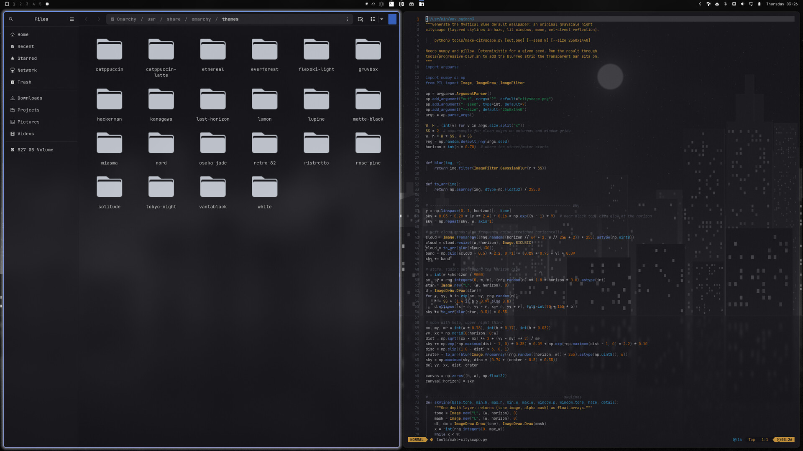
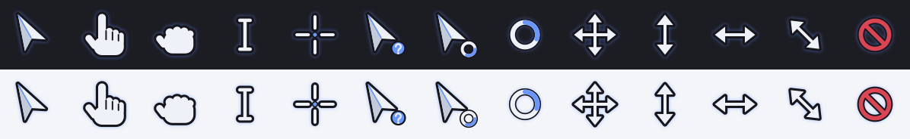
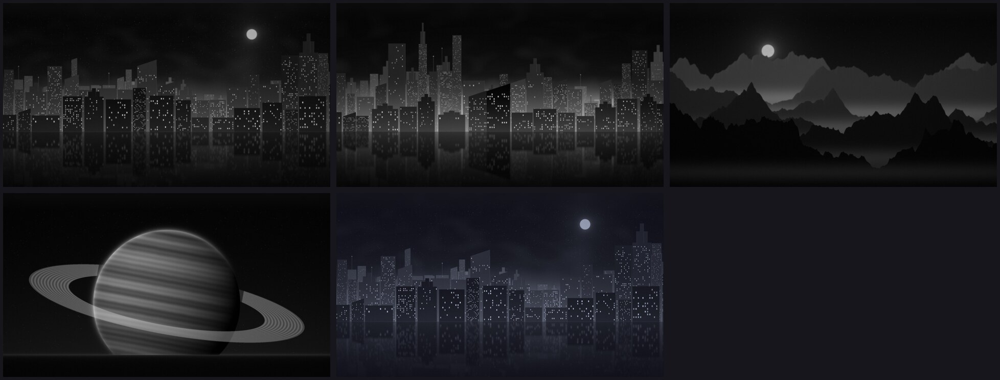

# Monogray for Omarchy

A glassy gray-and-blue theme for [Omarchy](https://omarchy.org), with
monochrome icons, grayscale wallpapers, a dock in the top bar and its own
cursor. It's based on Juxtopposed's KDE Plasma theme
[Mystical Blue](https://github.com/juxtopposed/Mystical-Blue-Theme).



## What you get

- **Colors** from the original KDE color scheme, used for terminals, btop,
  Neovim, VS Code, menus, notifications and the lock screen.
- **Glass windows**: 85% opaque when focused and 75% when not, blurred behind,
  with rounded corners, a blue gradient border and a soft gray glow.
- **A clear top bar**, like the original's transparent panel. Each wallpaper has
  a blurred strip along the top edge, so the bar still reads as frosted glass.
- **Monogray Dock**: an icon-only app dock in the center of the bar, like the
  original's top-panel task manager. It has pinned and running apps, monochrome
  icons, and a thin line above running apps that turns blue for the focused one.
- **Files (Nautilus) and other GTK apps** styled after the original's Dolphin
  look: slate glass, JetBrains Mono, and a highlight on the selected sidebar row
  that fades out to the right.
- **Monogray Cursor**: an original cursor set with a pale body, a thin dark
  outline and a soft blue glow. It stays visible on dark glass and on white
  pages. The crosshair dot, the loading spinner and the help badge use the
  theme's blue.

  

- **Monochrome icons** from
  [Yet Another Monochrome Icon Set](https://bitbucket.org/dirn-typo/yet-another-monochrome-icon-set),
  the set the original uses.
- **Code - OSS support**: Omarchy only themes the Microsoft VS Code build, and
  this also themes the open-source `code` package from the Arch repos.
- **Five original wallpapers** to choose from:



Switch wallpapers from the Omarchy menu (**Style → Background**) or with
`omarchy theme bg next`.

## What's in this folder

The top level is the Omarchy theme itself (`colors.toml`, `hyprland.lua`,
`shell.toml`, `gtk.css`, `backgrounds/` and so on), so Omarchy can install it
straight from GitHub. The extras live in subfolders:

| Folder     | What it is                                                    |
|------------|---------------------------------------------------------------|
| `dock/`    | The Monogray Dock bar widget (`monogray.dock`)                |
| `cursor/`  | The Monogray Cursor plugin (`monogray.cursor`) and cursor set |
| `hooks/`   | Theme-switch hook for GTK apps and Code - OSS                 |
| `tools/`   | Scripts that generate the wallpapers and cursors              |

## Install

**1. Install the theme:**

```bash
omarchy theme install https://github.com/Halftec/Monogray-theme
```

This gives you the colors, the wallpapers, the clear bar and the glass menus.

**2. Add everything else (recommended):**

```bash
~/.config/omarchy/themes/monogray/install.sh
```

Omarchy doesn't let a theme installed from GitHub run code, so step 1 leaves
out the glass windows and blur (they live in `hyprland.lua`), the dock, the
cursor, the icon set and the Files/VS Code styling. The installer adds them.
It's short, so read it first if you like. It:

1. Moves the downloaded theme to `~/.local/share/monogray-theme`, where it's
   still a git clone you can update, and installs the theme files as a regular
   user theme so Omarchy keeps `hyprland.lua`.
2. Downloads the icon set to `~/.local/share/icons` (no sudo needed).
3. Adds a theme-set hook that styles GTK apps and Code - OSS.
4. Adds the dock to the center of the bar and moves the clock to the far right.
   It backs up `~/.config/omarchy/shell.json` first.
5. Adds the cursor plugin. It sets the cursor for Hyprland, GTK and XWayland
   apps, and adds a marked block to `~/.config/uwsm/env-hyprland` so the cursor
   is in place from the start of every login.
6. Switches to the theme.

Options: `--no-dock`, `--no-layout` (add the dock but leave the bar layout
alone), `--no-icons`, `--no-cursor`, and `--link` (symlink instead of copy, for
working on the theme).

You can also skip step 1: `git clone` the repo anywhere and run `./install.sh`
from it.

To update later, run `git -C ~/.local/share/monogray-theme pull`, then run
`install.sh` from that folder again.

## Pinning apps in the dock

The dock comes with five apps that ship with every Omarchy install: Files,
Chromium, Terminal, Obsidian and LibreOffice. To change them, edit the dock's
entry in `~/.config/omarchy/shell.json`. Changes apply as soon as you save:

```json
{
  "id": "monogray.dock",
  "pinned": ["org.gnome.Nautilus", "chromium", "foot", "obsidian", "libreoffice-startcenter"],
  "monochrome": true
}
```

Pins are `.desktop` file names without the extension (see
`ls /usr/share/applications`). Pins for apps that aren't installed are skipped.

| Click  | Action                                        |
|--------|-----------------------------------------------|
| Left   | Open the app, focus it, or cycle its windows   |
| Middle | Close all of the app's windows                 |
| Right  | Open a new window                              |

## Tweaking

| What                         | Where                                                       |
|------------------------------|-------------------------------------------------------------|
| Window opacity               | `hyprland.lua`, `opacity = "0.85 0.75"`       |
| Borders, glow, blur          | `hyprland.lua`                                |
| Bar, menu, popup transparency| `shell.toml`                                  |
| Palette                      | `colors.toml`                                 |
| Files / GTK look             | `gtk.css` (GTK4), `gtk3.css`    |

Edit the copy in `~/.config/omarchy/themes/monogray/`, then run
`omarchy theme set monogray`.

Video apps, games, VMs and picture-in-picture windows stay fully opaque, as
Omarchy intends.

### Using your own wallpaper

To give any image the blurred strip the clear bar sits on:

```bash
tools/progressive-blur.sh my-image.jpg ~/.config/omarchy/backgrounds/monogray/my-image.jpg
```

Omarchy adds images from that folder to the theme's wallpaper rotation.

### Cursor

The cursors are drawn in `tools/make-cursors.py`. The colors and every shape
are at the top of that file, and the SVG sources are in `cursor/svg/`.
To rebuild after editing (needs `rsvg-convert`, `magick` and `hyprcursor-util`,
which are all on Omarchy already):

```bash
python3 tools/make-cursors.py cursor/theme
omarchy restart shell
```

To turn the cursor off and go back to the default, run
`omarchy plugin disable monogray.cursor` and then
`~/.config/omarchy/plugins/monogray.cursor/apply.sh --off`.

### Regenerating the wallpapers

The wallpapers are generated procedurally and are reproducible:

```bash
python -m venv .venv && .venv/bin/pip install numpy pillow
tools/build-wallpapers.sh .venv/bin/python
```

## Uninstall

Run `uninstall.sh` from the repo folder. That's `~/.local/share/monogray-theme`
if you installed with `omarchy theme install`.

```bash
cd ~/.local/share/monogray-theme
./uninstall.sh                # switches to tokyo-night, then removes everything
./uninstall.sh gruvbox        # pick the theme to switch to
./uninstall.sh --remove-icons # also delete the icon set
```

## Credits

- Original design and colors: [Mystical Blue](https://github.com/juxtopposed/Mystical-Blue-Theme)
  by Juxtopposed (MIT).
- Icons: [Yet Another Monochrome Icon Set](https://bitbucket.org/dirn-typo/yet-another-monochrome-icon-set)
  by dirn (GPL-3.0). The installer downloads it; this repo doesn't include it.
- Wallpapers and cursors: original, generated by the scripts in `tools/`.

## License

MIT. See [LICENSE](LICENSE).
